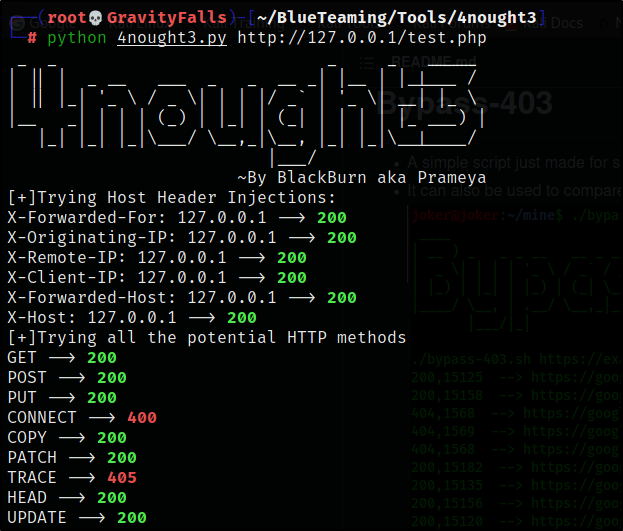

# 4nought3
A python script to bypass 403-forbidden. It covers methods like Host-Header Injections, Changing HTTP Requests Methods and URL-Injections.
## Usage
'git clone '
'cd 4nought3'
'python 4nought3 http://127.0.0.1/forbidden.php'

